<div align="center">

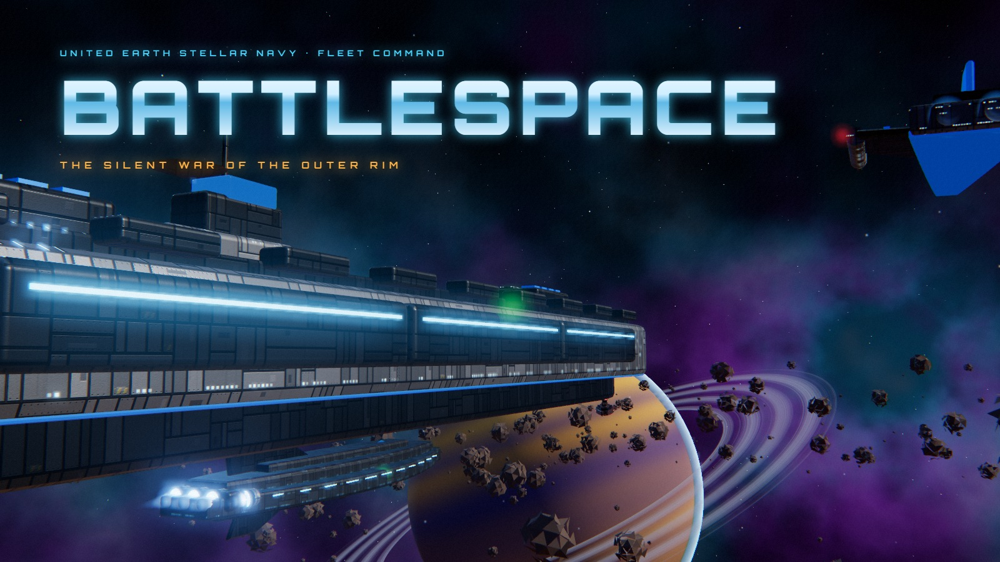

# BATTLESPACE

**Classic naval strategy, fought between starfleets in orbit.**

A cinematic 3D take on Battleship for the browser, with procedural starships, per-section damage, a camera that follows every salvo, and a synthesized monk-choir soundtrack. Built entirely with code: no models, textures or audio files.

### [▶ Play in your browser](https://nmick1995.github.io/battlespace/)

[Features](#features) · [Gallery](#gallery) · [Run locally](#play-it) · [Rules](#rules-of-engagement) · [How it's made](#how-its-made)

</div>

---

## About

Two fleets hold position above a ringed gas giant, each hidden from the other behind cloaking fields. You get one salvo per turn. Every shot you fire becomes a short cinematic: the camera drops in beside one of your ships, its turrets swing toward the target, and the camera rides the salvo across the gap. If you hit, you see an explosion and nothing else, because the enemy hull stays cloaked. If you miss, the round fades out in a soft ripple.

Once every section of a ship has been hit, its cloak fails. The camera circles the hull while the damage from earlier hits glows through the plating, secondary explosions run along the ship, and the reactor goes up and breaks the ship into burning pieces. Your own ships get the same treatment.

The rules are the classic ones. The rest is space opera.

## Features

- **Five distinct starship classes.** Each has its own hull and weapon system:

  | Class | Size | Weapon | Style |
  |---|---|---|---|
  | Leviathan Carrier | 5 | VLS missile swarm | Missiles launch upward and curve in on smoke trails |
  | Dreadnought Battleship | 4 | Twin plasma batteries | Three turrets that track the target and fire heavy plasma |
  | Vanguard Cruiser | 3 | Spinal railgun | Charges up, then fires a slug with a shockwave |
  | Phantom Stealth Frigate | 3 | Void torpedoes | Spiraling violet torpedoes |
  | Lancer Destroyer | 2 | Pulse lasers | Quick green bursts from pods on the wingtips |

- **Damage by section.** Every grid cell a ship covers is its own section. A hit section chars and glows with molten cracks, catches fire and smokes, sparks, loses its lights, engines and turrets, and sheds loose parts.
- **Cinematics for everything.** Firing shots, chase cams, impact cuts, incoming-fire warnings and ship destruction, all with letterboxing, film grain, chromatic aberration, slow motion and screen shake. Hold `Space` to fast-forward.
- **Nothing gives away enemy positions.** Enemy ships stay invisible until they sink. Enemy fire comes from off-screen, so it never reveals where their fleet is.
- **An original generated soundtrack.** Menu music is Gregorian-style chant with an organum choir, full choir chords, taiko drums and string ostinatos. In-game music is a quieter, tense ambient version. Every sound effect is synthesized live with the Web Audio API.
- **Three AI threat levels.** Cadet, Commander and Admiral. Admiral scores every legal placement of your remaining ships and fires at the most likely cell.
- **A living backdrop.** Procedural nebula, a gas giant with rings and an atmosphere, a drifting asteroid field, and HDR bloom.

## Gallery

<table>
<tr>
<td width="50%">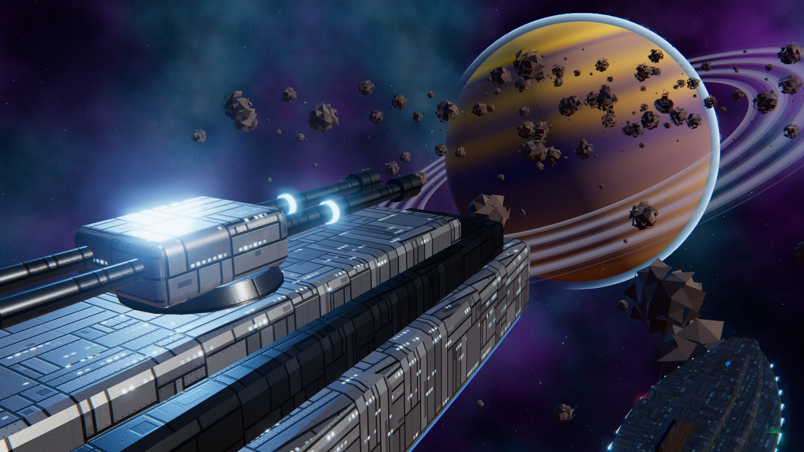<br><sub><b>Main menu</b>: the camera flies past the fleet in formation</sub></td>
<td width="50%">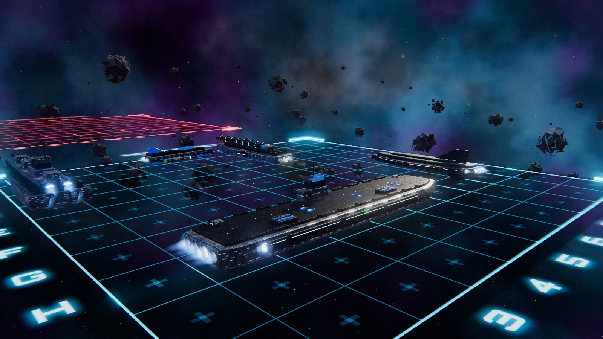<br><sub><b>Deployment</b>: your fleet on the holographic grid</sub></td>
</tr>
<tr>
<td>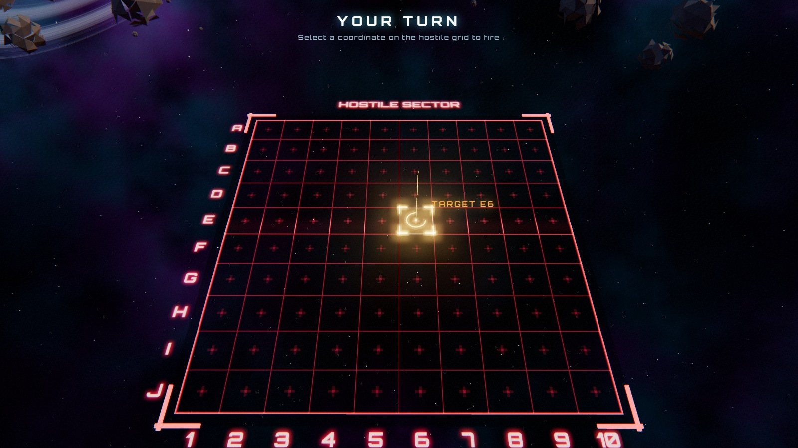<br><sub><b>Targeting</b>: choose a coordinate on the hostile sector</sub></td>
<td>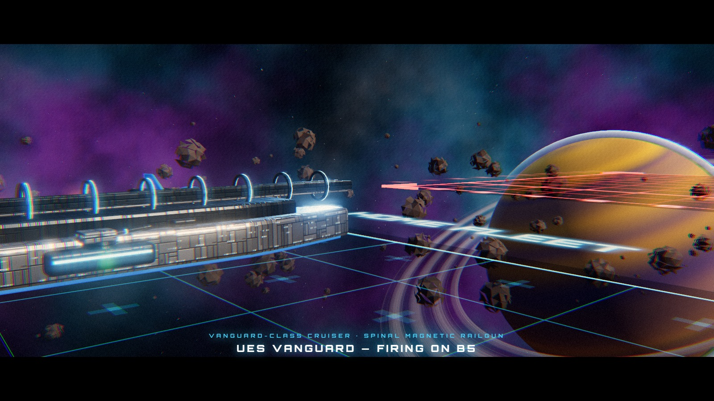<br><sub><b>Firing solution</b>: the Vanguard lines up its spinal railgun</sub></td>
</tr>
<tr>
<td>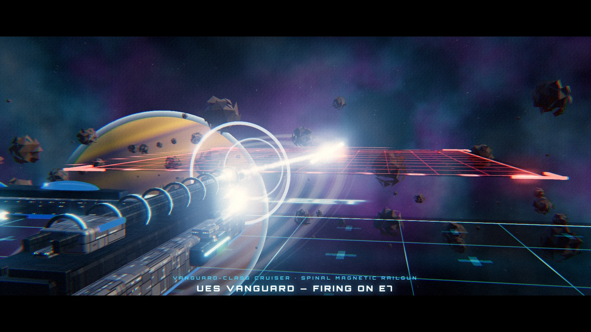<br><sub><b>Railgun discharge</b>: the magnetic coils fire the slug</sub></td>
<td>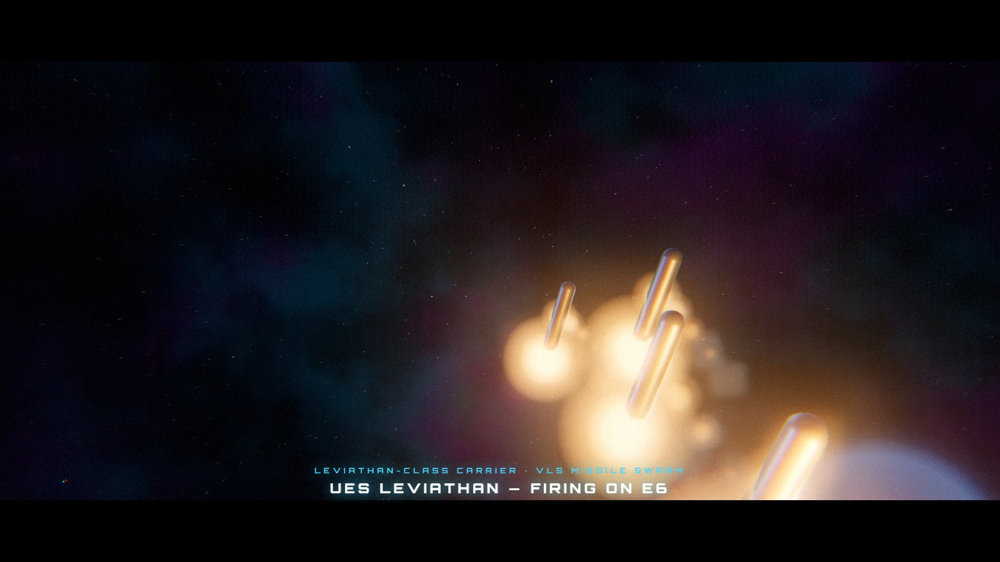<br><sub><b>Chase cam</b>: following the Carrier's missile swarm</sub></td>
</tr>
<tr>
<td>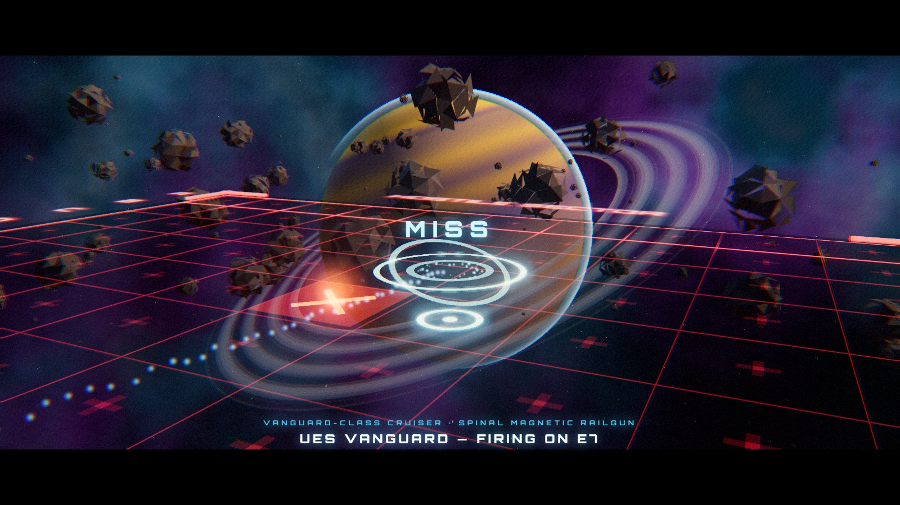<br><sub><b>Miss</b>: the round fades out in a circular wave</sub></td>
<td>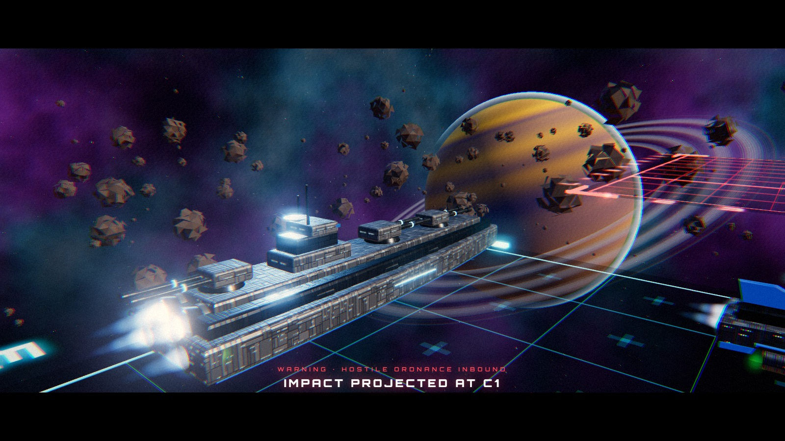<br><sub><b>Incoming</b>: hostile plasma closes on the Dreadnought</sub></td>
</tr>
<tr>
<td>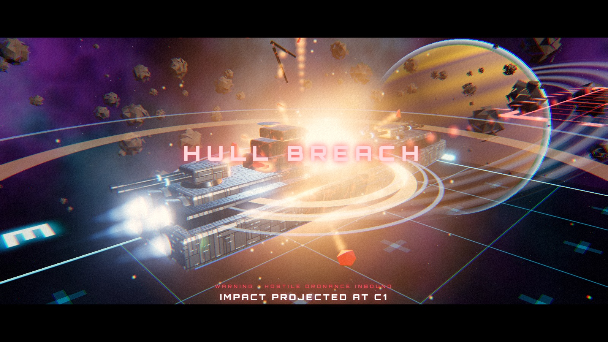<br><sub><b>Hull breach</b>: debris blown off the struck section</sub></td>
<td>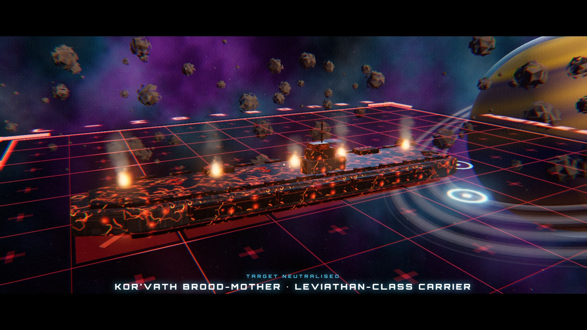<br><sub><b>Target neutralised</b>: the enemy carrier's cloak fails, showing every hit</sub></td>
</tr>
<tr>
<td>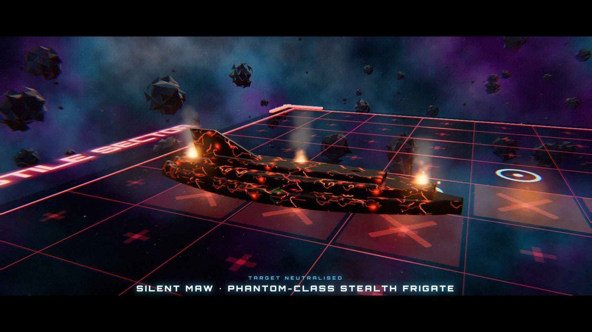<br><sub><b>Stealth frigate revealed</b>, burning from stern to bow</sub></td>
<td>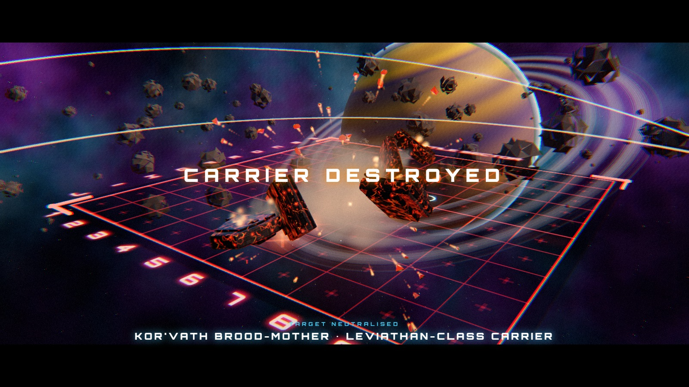<br><sub><b>Reactor breach</b>: the hull breaks into burning pieces</sub></td>
</tr>
<tr>
<td>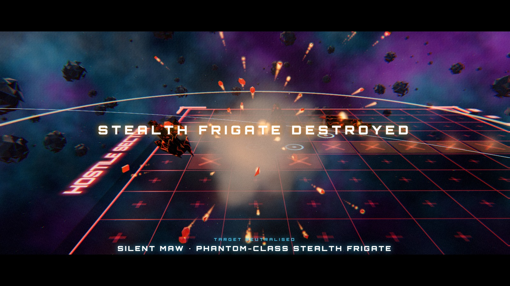<br><sub><b>Stealth frigate destroyed</b></sub></td>
<td>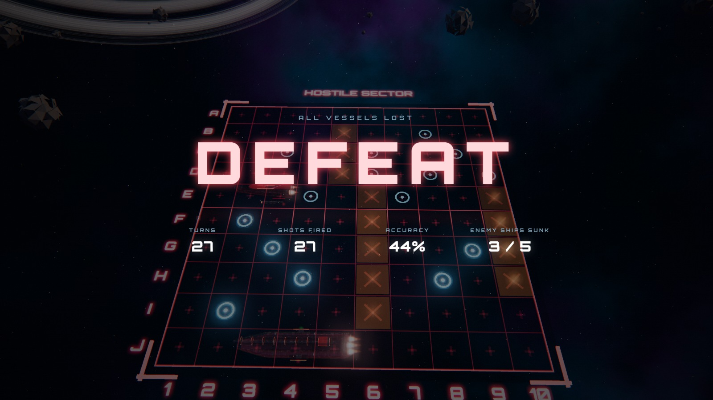<br><sub><b>Defeat</b>: the Commander AI won this match, and its survivors are revealed</sub></td>
</tr>
</table>

## Play it

**No install needed:** play at **https://nmick1995.github.io/battlespace/** in any modern desktop browser with WebGL2.

To run it locally instead, you need [Node.js](https://nodejs.org/) (any recent version) and an internet connection the first time, to load Three.js and fonts from a CDN. There are no dependencies to install.

```bash
git clone https://github.com/Nmick1995/battlespace.git
cd battlespace
npm start
```

Then open **http://localhost:8080**. On Windows you can also double-click `start.bat`.

> Any static file server works (for example `python -m http.server 8080`). Opening `index.html` straight from disk won't work, because browsers block ES modules loaded from `file://`.

Use headphones. The soundtrack is half the experience.

## Rules of engagement

BattleSpace follows the classic rules of Battleship.

1. **Deploy.** Each side places five ships on its own 10×10 grid: Carrier (5), Battleship (4), Cruiser (3), Stealth Frigate (3, the classic "submarine"), and Destroyer (2). Ships go horizontally or vertically. They can't be placed diagonally or overlap.
2. **Fire.** Players take turns firing one salvo at a coordinate on the enemy's grid, such as `C7`.
3. **Report.** Each shot is called as a hit or a miss. Hits are marked in red and misses in cyan, so you never waste a shot.
4. **Sink.** When every section of a ship has been hit, the ship is destroyed and its class is announced.
5. **Win.** The first commander to destroy the entire enemy fleet wins.

### Controls

| Action | Input |
|---|---|
| Place ship | Left click |
| Rotate ship | `R` or right click |
| Fire | Left click on the hostile grid |
| Toggle fleet / target view | `V` |
| Fast-forward a cinematic | Hold `Space` |
| Mute | `M` |

### Threat levels

| Level | Doctrine | Avg. shots to win* |
|---|---|---|
| **Cadet** | Random fire, then probes around hits | ~63 |
| **Commander** | Hunt & target with checkerboard parity | ~51 |
| **Admiral** | Probability density over every legal remaining ship placement | ~44 |

<sub>*Measured over 200 simulated games per level.</sub>

## How it's made

Everything you see and hear is generated at runtime. The repository contains no binary assets apart from the screenshots.

| File | Responsibility |
|---|---|
| [`js/main.js`](js/main.js) | Game flow, turns, cinematic direction, UI and input |
| [`js/ships.js`](js/ships.js) | Procedural starship models, built per section for localized damage and breakup |
| [`js/fx.js`](js/fx.js) | GPU particle system, explosions, shockwaves, debris and projectiles |
| [`js/world.js`](js/world.js) | Renderer, bloom and film post-processing, nebula shader, planet, asteroids, holographic grids and the camera rig |
| [`js/audio.js`](js/audio.js) | Web Audio soundtrack (formant-filtered choir, taiko, strings, brass) and all sound effects |
| [`js/ai.js`](js/ai.js) | The three opponent AIs |
| [`js/core.js`](js/core.js) | Game-time tween/sequence engine, which is what lets cinematics fast-forward |

Some implementation details:

- **Ships** are built from extruded hull profiles, rounded boxes and cylinders, cut into one "segment" per grid cell. Each segment gets its own copy of the materials, so a hit can char that section without touching the rest. When a ship is destroyed, its segments detach and tumble away as separate burning pieces.
- **Hull plating, window lights and burn cracks** are canvas-generated textures, projected onto every part with box-mapped UVs.
- **The choir** is detuned sawtooth voices with vibrato, run through band-pass filters tuned to the resonances of vowels like "ah", "oh" and "oo", then into a long convolution reverb that simulates a cathedral.
- **Cinematics** are `async` sequences driven by a game clock, so holding `Space` speeds up everything evenly: camera moves, particles and projectiles.

Built with [Three.js](https://threejs.org/) and plain ES modules. There's no build step.

## Contributing

Issues and pull requests are welcome. Some ideas:

- The **Salvo** variant, where you get one shot per surviving ship each turn
- Local two-player hot-seat mode
- More ship classes and faction hull styles
- Mobile touch controls

## License

[MIT](LICENSE). Free to use, modify and share.

BattleSpace is an independent fan project inspired by the classic pencil-and-paper game. It is not affiliated with or endorsed by Hasbro, owner of the *Battleship* trademark, or by the owners of *Halo*. The soundtrack is an original composition.
